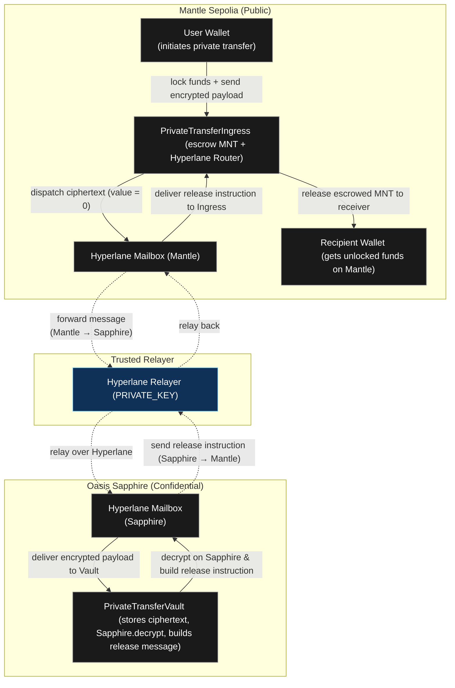

# c0gito: Private Cross-Chain Transfers on Mantle

> **THINK. TRANSFER. VANISH.**  
> Incognito mode for cryptocurrency transfers powered by Oasis Sapphire confidential computation.

[](https://www.mantle.xyz)
[](https://sapphire.oasis.io)
[](https://www.hyperlane.xyz)

## 🎯 Overview

**c0gito** is a privacy-preserving cross-chain transfer protocol that enables completely confidential cryptocurrency transfers between users. By leveraging Oasis Sapphire's confidential computing capabilities and Hyperlane's cross-chain messaging, c0gito ensures that transfer details (recipient, amount, memo) remain encrypted and private throughout the entire transaction lifecycle.

### Problem Statement

Traditional blockchain transfers expose sensitive information on-chain:
- **Recipient addresses** are publicly visible
- **Transfer amounts** are transparent
- **Transaction memos** are readable by anyone
- **Privacy concerns** prevent adoption in sensitive use cases

### Our Solution

c0gito solves this by:
- 🔒 **Encrypting transfer payloads** using X25519DeoxysII encryption before on-chain submission
- 🛡️ **Confidential processing** on Oasis Sapphire, where decryption happens in a trusted execution environment
- 🌉 **Cross-chain architecture** using Hyperlane to bridge between Mantle (public) and Sapphire (confidential)
- 📊 **Real-time indexing** with Ponder for transparent tracking without exposing private data

---

## 🏗️ Architecture



### Key Components

1. **PrivateTransferIngress** (Mantle Sepolia)
   - Accepts deposits (Native MNT)
   - Escrows funds
   - Forwards encrypted payloads via Hyperlane
   - Releases funds upon receiving decrypted instructions

2. **PrivateTransferVault** (Oasis Sapphire)
   - Stores encrypted transfer payloads
   - Decrypts using Sapphire's confidential computing
   - Builds release instructions
   - Sends instructions back to Mantle via Hyperlane

3. **Ponder Indexer**
   - Indexes events from both chains
   - Tracks deposit and transfer status
   - Provides GraphQL API for frontend

4. **c0gito Service**
   - Monitors pending transfers
   - Automatically processes transfers on Sapphire
   - Handles acknowledgment flow

5. **Frontend (Next.js)**
   - User-friendly interface for deposits and transfers
   - Real-time status tracking
   - Privacy-focused UX

---

## ✨ Features

### 🔐 Privacy Features
- **End-to-end encryption** using X25519DeoxysII
- **Confidential decryption** on Oasis Sapphire TEE
- **No on-chain exposure** of recipient, amount, or memo
- **Selective disclosure** - only encrypted hash visible on Mantle

### 🌉 Cross-Chain Capabilities
- **Seamless bridging** between Mantle and Sapphire via Hyperlane
- **Trustless messaging** using Hyperlane's security model
- **Automatic processing** with service layer

### 💰 Token Support
- **Native MNT** transfers (ERC20 support in contracts, frontend coming soon)
- **Flexible deposits** - one deposit can fund multiple transfers

### 🎨 User Experience
- **Intuitive UI** with pixelated retro-futuristic design
- **Real-time status** updates
- **Transaction history** tracking
- **Responsive design** for all devices

---

## 🛠️ Tech Stack

### Smart Contracts
- **Solidity** ^0.8.24
- **OpenZeppelin** Contracts
- **Hyperlane** Core for cross-chain messaging
- **Oasis Sapphire** Contracts for confidential computing

### Frontend
- **Next.js** 16.1.1
- **Wagmi** & **RainbowKit** for wallet integration
- **Viem** for Ethereum interactions
- **Tailwind CSS** for styling
- **TypeScript** for type safety

### Infrastructure
- **Ponder** for event indexing
- **GraphQL** API for data queries
- **Node.js** service layer for automation

### Development Tools
- **Hardhat** for contract development
- **TypeScript** throughout

---

## 🚀 Getting Started

This section will guide you through setting up and running c0gito locally or using the deployed contracts.

### Prerequisites

- **Node.js** 18+ and npm/yarn
- **MetaMask** or compatible Web3 wallet
- **Mantle Sepolia testnet MNT** (for gas fees)
- **Access to Oasis Sapphire Testnet** (for testing)

### Quick Start (Using Deployed Contracts)

If you want to quickly test the application without deploying contracts:

1. **Clone and install**
```bash
git clone https://github.com/yourusername/c0gito.git
cd c0gito
npm install
```

2. **Configure environment** (use deployed addresses from [Deployed Contracts](#-deployed-contracts))
```bash
# Mantle Sepolia
INGRESS_ADDRESS=0xEE5F31d28F08a011f638fd2b82CCbcb5ce04ab48
ROUTER_ADDRESS=0xEE5F31d28F08a011f638fd2b82CCbcb5ce04ab48
ISM_ADDRESS=0xDfA1f3F3865a24ddD7B0A5d89ac4D80c75AD2Bc8
TRUSTED_RELAYER=0x8193A12e9dc9371b231863CE2D7fd46E405E5e16

# Oasis Sapphire Testnet
VAULT_ADDRESS=0x418A949474971a1947d932f856FB3eAA695BDdE5
VAULT_PUBLIC_KEY=0x7e9bbbb5d644e0afacb4da4633a9dbd433febe9190edbf5c6604306be96f182d
```

3. **Start services**
```bash
# Terminal 1: Frontend
npm run dev

# Terminal 2: Indexer
cd c0gito-indexer && npm install && npm run dev

# Terminal 3: Service (optional)
cd c0gito-service && npm install && npm run dev
```

4. **Open** [http://localhost:3000](http://localhost:3000)

### Full Installation

1. **Clone the repository**
```bash
git clone https://github.com/yourusername/c0gito.git
cd c0gito
```

2. **Install dependencies**
```bash
# Root dependencies
npm install

# Indexer dependencies
cd c0gito-indexer && npm install && npm run dev

# Service dependencies
cd c0gito-service && npm install && npm run dev
```

3. **Set up environment variables**

### Environment Variables Examples

**Frontend (`.env`):**
```env
# Mantle Sepolia Contracts
NEXT_PUBLIC_INGRESS_ADDRESS=0xEE5F31d28F08a011f638fd2b82CCbcb5ce04ab48
NEXT_PUBLIC_ROUTER_ADDRESS=0xEE5F31d28F08a011f638fd2b82CCbcb5ce04ab48
NEXT_PUBLIC_ISM_ADDRESS=0xDfA1f3F3865a24ddD7B0A5d89ac4D80c75AD2Bc8
NEXT_PUBLIC_TRUSTED_RELAYER=0x8193A12e9dc9371b231863CE2D7fd46E405E5e16

# Oasis Sapphire Contracts
NEXT_PUBLIC_VAULT_ADDRESS=0x418A949474971a1947d932f856FB3eAA695BDdE5
NEXT_PUBLIC_VAULT_PUBLIC_KEY=0x7e9bbbb5d644e0afacb4da4633a9dbd433febe9190edbf5c6604306be96f182d

# Ponder Indexer
NEXT_PUBLIC_PONDER_GRAPHQL_URL=http://localhost:42069/graphql

# Wallet Connect ID
NEXT_PUBLIC_WALLETCONNECT_PROJECT_ID=<YOURS>

# Additional
MANTLE_MAILBOX=0xE495652b291B836334465680156Ce50a100aF52f
SAPPHIRE_MAILBOX=0x79d3ECb26619B968A68CE9337DfE016aeA471435
MANTLE_DOMAIN=5003
SAPPHIRE_DOMAIN=23295

```

**Indexer (`c0gito-indexer/.env`):**
```env
PONDER_RPC_URL_MANTLE_SEPOLIA=https://rpc.sepolia.mantle.xyz
PONDER_RPC_URL_SAPPHIRE_TESTNET=https://testnet.sapphire.oasis.io
INGRESS_ADDRESS=0xEE5F31d28F08a011f638fd2b82CCbcb5ce04ab48
VAULT_ADDRESS=0x418A949474971a1947d932f856FB3eAA695BDdE5
```

**Service (`c0gito-service/.env`):**
```env
PONDER_API_URL=http://localhost:42069/graphql
SAPPHIRE_RPC_URL=https://testnet.sapphire.oasis.io
VAULT_ADDRESS=0x418A949474971a1947d932f856FB3eAA695BDdE5
OWNER_PRIVATE_KEY=0x...
POLL_INTERVAL=10000
MAX_RETRIES=3
RETRY_DELAY=5000
```

4. **Start the development server**
```bash
npm run dev
```

5. **Start the Ponder indexer** (in separate terminal)
```bash
cd c0gito-indexer
npm install
npm run dev
```

6. **Start the service** (optional, for automatic processing)
```bash
cd c0gito-service
npm install
npm run dev
```

7. **Open [http://localhost:3000](http://localhost:3000)** in your browser

### Contract Deployment

#### Quick Deployment (Using Deployed Contracts)

If you want to use the already deployed contracts, simply configure your environment variables with the addresses below (see [Deployed Contracts](#-deployed-contracts)).

#### Full Deployment Guide

For deploying your own contracts, see the detailed guide in [`scripts/deploy/README.md`](scripts/deploy/README.md).

**Quick Steps:**
1. Deploy `TrustedRelayerIsm` on Mantle Sepolia
2. Deploy `PrivateTransferIngress` on Mantle Sepolia
3. Deploy `PrivateTransferVault` on Oasis Sapphire Testnet
4. Enroll contracts with Hyperlane
5. Configure frontend with contract addresses

**Deployment Commands:**
```bash
# Deploy ISM
npx hardhat run scripts/deploy/deployISM.ts --network mantleSepolia

# Deploy Ingress
npx hardhat run scripts/deploy/deployIngress.ts --network mantleSepolia

# Deploy Vault
npx hardhat run scripts/deploy/deployVault.ts --network sapphireTestnet

# Enroll with Hyperlane
npx hardhat run scripts/enroll/enrollIngress.ts --network mantleSepolia
npx hardhat run scripts/enroll/enrollVault.ts --network sapphireTestnet
```

---

## 📖 Usage

### For Users

1. **Connect Wallet**
   - Click "CONNECT" button
   - Select Mantle Sepolia network
   - Approve connection

2. **Deposit Funds**
   - Click "DEPOSIT" button
   - Enter amount in MNT
   - Confirm transaction
   - Save your deposit ID

3. **Initiate Private Transfer**
   - Select a deposit from dropdown
   - Enter recipient address
   - Enter amount (or use percentage buttons)
   - Add optional memo
   - Click "SEND TRANSFER"

4. **Track Status**
   - View transaction status in dialog
   - Check recent transfers section
   - Monitor on Mantle Explorer

---

## 🧪 Testing

### Running Contract Tests

The project includes comprehensive unit tests for smart contracts using Hardhat v2.

```bash
# Run all tests
npx hardhat test

# Run with coverage
npx hardhat coverage

# Run specific test file
npx hardhat test test/PrivateTransferIngress.test.ts
```

### Test Coverage

- ✅ **PrivateTransferIngress**: 17 test cases covering deposits, transfers, mappings, and edge cases
- ✅ **TrustedRelayerIsm**: Constructor validation and verification logic

**Test Results:**
```
✓ 17 passing (713ms)
```

### Test Files

- `test/PrivateTransferIngress.test.ts` - Main ingress contract tests
- `test/TrustedRelayerIsm.test.ts` - ISM verification tests
- `contracts/test/MockMailbox.sol` - Mock Hyperlane Mailbox for testing
- `contracts/test/MockERC20.sol` - Mock ERC20 token for testing

---

---

## 📁 Project Structure

```
c0gito/
├── contracts/              # Smart contracts
│   ├── PrivateTransferIngress.sol
│   ├── PrivateTransferVault.sol
│   └── TrustedRelayerIsm.sol
├── src/                    # Frontend application
│   ├── app/                # Next.js pages
│   ├── components/         # React components
│   ├── hooks/              # Custom React hooks
│   └── lib/                # Utilities & ABIs
├── c0gito-indexer/         # Ponder indexer
│   ├── src/index.ts        # Event handlers
│   └── ponder.schema.ts    # GraphQL schema
├── c0gito-service/         # Backend service
│   ├── src/monitor.ts      # Transfer monitoring
│   └── src/processor.ts   # Transfer processing
├── scripts/                # Deployment scripts
└── test/                   # Contract tests
```

---

## Mantle Integration
- ✅ Built on **Mantle Sepolia** testnet
- ✅ Leverages **Mantle's low fees** for cost-effective transfers
- ✅ Uses **Mantle's EVM compatibility** for seamless development
- ✅ Integrates with **Mantle ecosystem** tools
- ✅ **Hyperlane integration** for cross-chain messaging
- ✅ **Mantle Explorer** integration for transaction tracking

---

## 🗺️ Roadmap

**Q1 2026** – ERC20 token support with whitelist management; batch transfer functionality for multiple recipients; gas optimization improvements.

**Q2 2026** – Mainnet deployment on Mantle; comprehensive security audit; governance token launch & DAO structure for protocol decisions.

**Q3 2026** – Mobile app with WalletConnect integration; additional chain support (Arbitrum, Optimism); advanced privacy features (stealth addresses, optional memo encryption).

**Q4 2026** – Enterprise API marketplace for B2B integrations; analytics dashboard with transfer insights; protocol partnerships & integrations.

**Always-on** – Monitoring & observability (Ponder → Grafana dashboards); Sapphire TEE health checks; automated service layer with retry mechanisms; community support & documentation updates.

---

## 🔒 Security & Compliance

### Security Measures
- ✅ Smart contract audits (planned)
- ✅ Encrypted payload storage
- ✅ Confidential execution environment
- ✅ Access control mechanisms

### Compliance Declaration

**⚖️ COMPLIANCE DECLARATION**

**This project does NOT involve regulated assets.**

c0gito is a privacy-preserving transfer protocol that:
- ✅ **Does NOT handle securities** or regulated financial instruments
- ✅ **Does NOT require KYC/AML** for basic transfers
- ✅ **Operates as a technical infrastructure layer** for private transfers
- ✅ **Complies with applicable blockchain regulations**
- ✅ **No illegal activity** - privacy for legitimate use cases only

**Regulatory Status:**
- c0gito is a protocol for private cryptocurrency transfers
- It does not issue tokens, securities, or financial instruments
- It does not provide custodial services
- Users maintain full control of their funds
- The protocol is designed to be regulatory-friendly while preserving user privacy

---

## 👥 Team

**Evril Fadrekha Cahyani**

Solo developer passionate about privacy and user sovereignty. My mission is to bring true privacy to cross-chain transfers while maintaining regulatory compliance and excellent user experience.

### About

I am a full-stack blockchain developer specializing in:
- **Smart Contract Development** - Solidity, Hardhat, comprehensive testing
- **Frontend Development** - Next.js, React, TypeScript, 
- **Infrastructure & DevOps** - Ponder indexing, GraphQL APIs, service automation

### Contact Information

- **Name**: Evril Fadrekha Cahyani
- **Email**: [your-email@example.com] (Update with your email)
- **GitHub**: [YourGitHub] (Update with your GitHub)

---

## 📄 License

Copyright c0gito team.

---

## 📞 Support & Links

### Demo & Documentation

- **Live Demo**: [Your Demo URL - Add when ready]
- **Video Demo**: [Your Video URL - 3-5 minutes walkthrough]
- **Documentation**: This README + [`scripts/deploy/README.md`](scripts/deploy/README.md)

## 📦 Deployed Contracts

These are the deployed contract addresses used by this project. Configure your environment variables with these addresses to interact with the live deployment.

### Mantle Sepolia

| Contract | Address | Explorer |
|----------|---------|----------|
| **PrivateTransferIngress**<br/>(`INGRESS_ADDRESS`, `ROUTER_ADDRESS`) | [`0xEE5F31d28F08a011f638fd2b82CCbcb5ce04ab48`](https://sepolia.mantlescan.xyz/address/0xEE5F31d28F08a011f638fd2b82CCbcb5ce04ab48) | [MantleScan](https://sepolia.mantlescan.xyz/address/0xEE5F31d28F08a011f638fd2b82CCbcb5ce04ab48) |
| **TrustedRelayerIsm**<br/>(`ISM_ADDRESS`) | [`0xDfA1f3F3865a24ddD7B0A5d89ac4D80c75AD2Bc8`](https://sepolia.mantlescan.xyz/address/0xDfA1f3F3865a24ddD7B0A5d89ac4D80c75AD2Bc8) | [MantleScan](https://sepolia.mantlescan.xyz/address/0xDfA1f3F3865a24ddD7B0A5d89ac4D80c75AD2Bc8) |
| **Trusted Relayer**<br/>(`TRUSTED_RELAYER`) | `0x8193A12e9dc9371b231863CE2D7fd46E405E5e16` | [MantleScan](https://sepolia.mantlescan.xyz/address/0x8193A12e9dc9371b231863CE2D7fd46E405E5e16) |

### Oasis Sapphire Testnet

| Contract | Address | Explorer |
|----------|---------|----------|
| **PrivateTransferVault**<br/>(`VAULT_ADDRESS`) | [`0x418A949474971a1947d932f856FB3eAA695BDdE5`](https://testnet.explorer.sapphire.oasis.dev/address/0x418A949474971a1947d932f856FB3eAA695BDdE5) | [Sapphire Explorer](https://testnet.explorer.sapphire.oasis.dev/address/0x418A949474971a1947d932f856FB3eAA695BDdE5) |
| **Vault Public Key**<br/>(`VAULT_PUBLIC_KEY`) | `0x7e9bbbb5d644e0afacb4da4633a9dbd433febe9190edbf5c6604306be96f182d` | - |
---


**Built with ❤️ for the Mantle Global Hackathon 2025**
